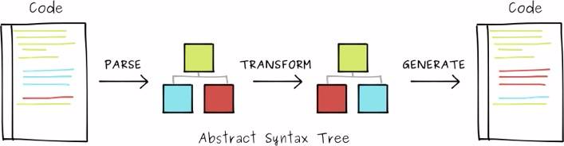
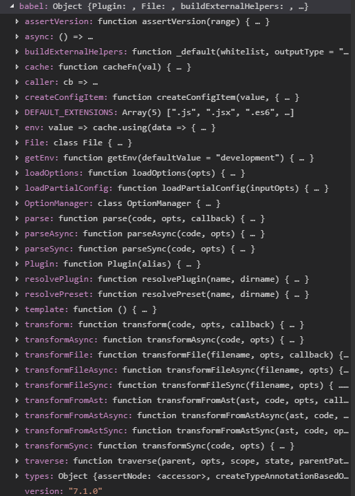

## 基础知识

babel 转换代码的过程：解析——转换——生成。


### 解析

Babel 读入源代码，经过词法分析、语法分析后，生成抽象语法树（AST）。

```
parse(sourceCode) => AST
```

### 转换

经过前一阶段的代码分析，Babel 得到了 AST。在原始 AST 的基础上，Babel 通过插件，对其进行修改，比如新增、删除、修改后，得到新的 AST。

```
transform(AST, BabelPlugins) => newAST
```

### 生成

通过前一阶段的转换，Babel 得到了新的 AST，然后就可以逆向操作，生成新的代码。

```
generate(newAST) => newSourceCode
```

## 写一个插件

babel 插件的语法，如下所示

babel 插件是一个 以`babel对象`为参数的一个`function`

```js
export default function(babel) {
  // 插件内容
}
```

具体的 babel 对象的内容，如下所示



但是一般写插件，经常 会用到`babel types` 所以经常这样写

```js
export default function({ types: t }) {
  // 插件内容
}
```

使用插件时我们可以给插件，添加配置，如下所示

```js
// .babelrc
{
  plugins: [
    [
      'my-plugin',
      {
        option1: true,
        option2: false,
      },
    ],
  ];
}
```

```js
// my-plugin
// 每个visitor 中的方法 有2个参数 path 和 state
// 通过 state 可以访问 插件的配置，及文件相关信息
export default function(babel) {
  return {
    visitor: {
      Identifier(path, state) {},
      FunctionDeclaration(path, state) {
        console.log(state.opts);
        // { option1: true, option2: false }
      },
    },
  };
}
```

具体 state 中的内容如下所示  


## 参考资料

https://github.com/jamiebuilds/babel-handbook/blob/master/translations/zh-Hans/README.md  
https://babeljs.io/docs/en/babel-types  
https://astexplorer.net/
